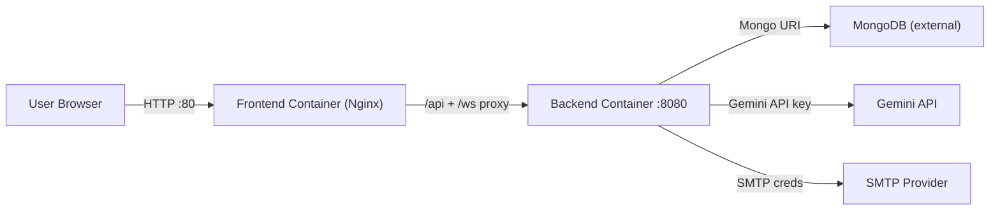

# `digital-twin-ai-deploy`

Deployment repository for the Digital Twin AI platform.

This repository does **not** contain application source code. It contains deployment assets, runtime configuration, and operational runbooks used to launch the platform consistently across local integration and server-based environments.

---

## Table of Contents

1. [Overview](#1-overview)
2. [How This Repo Fits Into the Platform](#2-how-this-repo-fits-into-the-platform)
3. [Repository Contents](#3-repository-contents)
4. [Deployment Topology](#4-deployment-topology)
5. [Prerequisites](#5-prerequisites)
6. [Environment Variables](#6-environment-variables)
7. [Quick Start (Docker Compose)](#7-quick-start-docker-compose)
8. [Local Development Helper Scripts](#8-local-development-helper-scripts)
9. [AWS Runbook Status](#9-aws-runbook-status)
10. [Operational Notes](#10-operational-notes)
11. [Troubleshooting](#11-troubleshooting)
12. [Security Checklist](#12-security-checklist)
13. [Recommended Next Improvements](#13-recommended-next-improvements)
14. [Ownership](#14-ownership)

---

## 1. Overview

`digital-twin-ai-deploy` is the deployment-facing companion repository for the Digital Twin AI platform. Its purpose is to centralize environment configuration, container orchestration, and deployment guidance so the application can be launched without modifying the frontend or backend source code.

The current setup is built around **Docker Compose** and **prebuilt container images**. The frontend is exposed publicly through Nginx on port `80`, while the backend runs privately inside the Compose network and is reached through frontend proxying.

This repository is intended for:

- local integration runs
- VM / EC2 deployment workflows
- runtime environment management
- deployment documentation and operational guidance

It is **not** intended for feature development or application source changes.

---

## 2. How This Repo Fits Into the Platform

The Digital Twin AI platform is split into three repositories:

| Repository | Responsibility |
|---|---|
| `digital-twin-ai-frontend` | React frontend application served through Nginx |
| `digital-twin-ai-backend` | Spring Boot backend API + WebSocket service |
| `digital-twin-ai-deploy` | Deployment assets, env templates, Compose orchestration, and runbooks |

This repo sits on top of the other two by consuming their built images and defining how they are launched together.

---

## 3. Repository Contents

| File | Purpose |
|---|---|
| `docker-compose.yml` | Launches frontend and backend containers together |
| `.env.example` | Template for required runtime environment variables |
| `AWS_DEMO_GUIDE.md` | Step-by-step AWS deployment runbook |
| `dev-start.ps1` | Windows helper script for local non-container startup |
| `dev-start.sh` | Linux/macOS helper script for local non-container startup |
| `.gitignore` | Prevents `.env` and other local runtime files from being committed |
| `README.md` | Deployment and operations guide for this repository |

---

## 4. Deployment Topology



### Current Compose Behavior

- `frontend` is published on host port `80`
- `backend` is only `expose`d on `8080` and stays internal to the Compose network
- `BACKEND_UPSTREAM` defaults to `backend:8080`
- Backend runs with `SPRING_PROFILES_ACTIVE=prod`

---

## 5. Prerequisites

Before using this repository, make sure you have:

- Docker Engine installed
- Docker Compose plugin available (`docker compose`)
- Access to the published container images:
  - `chinmay189jain/digital-twin-ai-backend:latest`
  - `chinmay189jain/digital-twin-ai-frontend:latest`
- Access to required external services:
  - MongoDB database
  - Gemini API access
  - SMTP account for OTP email delivery

---

## 6. Environment Variables

Create a local `.env` file from the example template:

```bash
cp .env.example .env
```

| Variable | Required | Used By | Description | Example |
|---|---|---|---|---|
| `MONGODB_URI` | Yes | backend | MongoDB connection string | `mongodb+srv://<user>:<pass>@<cluster>/<db>` |
| `JWT_SECRET` | Yes | backend | JWT signing secret | `<strong-random-secret>` |
| `GEMINI_API_KEY` | Yes | backend | Gemini API key | `<gemini-api-key>` |
| `SMTP_USERNAME` | Yes | backend | SMTP username/email | `no-reply@example.com` |
| `SMTP_PASSWORD` | Yes | backend | SMTP password/app-password | `<smtp-password>` |
| `CORS_ALLOWED_ORIGINS` | Yes | backend | Allowed frontend origins | `http://localhost` |
| `BACKEND_UPSTREAM` | Optional | frontend | Nginx upstream backend target | `backend:8080` |

### Important Notes

- `.env` is intentionally ignored by git
- Never commit real credentials
- Keep `.env.example` safe for sharing and `.env` local/private

---

## 7. Quick Start (Docker Compose)

From the repository root:

```bash
docker compose --env-file .env up -d
docker compose ps
```

### View Logs

```bash
docker compose logs -f backend
docker compose logs -f frontend
```

### Stop Services

```bash
docker compose down
```

### Access Points

- Frontend: `http://localhost`
- Backend: internal to Compose at `backend:8080`

Note: the backend is intended to be reached through the frontend proxy (`/api` and `/ws`), not directly from the browser in this topology.

---

## 8. Local Development Helper Scripts

### `dev-start.ps1` / `dev-start.sh`

These scripts start the backend and frontend directly, without Docker.

Current behavior:

- Backend starts with `mvnw spring-boot:run`
- Frontend starts with `npm start`
- Scripts expect sibling directories with these names relative to this repo:
  - `<repo-root>/digital-twin-ai-backend`
  - `<repo-root>/digital-twin-ai-frontend`

Because this deploy repo is separate from the application repos, these helper scripts only work if you keep all three repositories in a compatible local folder layout.

---

## 9. AWS Runbook Status

`AWS_DEMO_GUIDE.md` is present and documents an AWS deployment approach.

However, it currently references files that are **not present in this repository**:

- `docker-compose.backend.yml`
- `docker-compose.frontend.yml`
- `.env.backend.example`
- `.env.frontend.example`

Because of that, the AWS guide should currently be treated as **work-in-progress documentation** unless those referenced files are added.

---

## 10. Operational Notes

- Backend profile is forced to `prod` through Compose
- Frontend startup order depends on backend startup order via `depends_on`
- Compose currently does **not** define healthchecks
- Compose currently does **not** define restart policies
- Image tags currently use `latest`; version-pinned tags are safer for production deployments

---

## 11. Troubleshooting

### Frontend loads but API requests fail

- Check `BACKEND_UPSTREAM`
- Check whether the backend container is up and healthy
- Confirm Nginx proxy rules are aligned with backend endpoints

### Auth or chat requests fail due to CORS

- Verify `CORS_ALLOWED_ORIGINS` exactly matches the frontend origin
- Check whether the frontend is being accessed from `http://localhost`, a VM IP, or a domain name

### Backend fails to start

- Validate all required env vars are present and non-empty
- Check backend logs for MongoDB, Gemini, or SMTP startup issues

### Email OTP not sending

- Verify SMTP username/password
- Check provider requirements such as app passwords, TLS, or security settings

---

## 12. Security Checklist

- Keep `.env` local only
- Rotate exposed credentials immediately if they are ever committed or shared
- Use a strong `JWT_SECRET`
- Prefer least-privilege SMTP/API credentials
- Use managed secret storage (SSM / Secrets Manager / Vault) for cloud deployments instead of plaintext env files when possible

---

## 13. Recommended Next Improvements

- Add the split Compose/env files referenced by `AWS_DEMO_GUIDE.md`
- Add healthchecks and restart policies in `docker-compose.yml`
- Pin image tags to versioned releases instead of `latest`
- Add deployment validation steps such as `curl` checks or smoke tests
- Add CI/CD for automated image pull and deployment orchestration
- Add optional observability documentation for logs, metrics, and dashboards

---

## 14. Ownership

- **Repository**: `digital-twin-ai-deploy`
- **Purpose**: Deployment and operations assets for Digital Twin AI
- **Author / Owner**: `CHINMAY JAIN`
